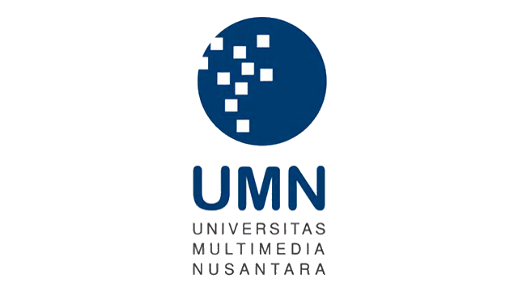

---
bibliography:
- ../../ref/library.bib
---

::: titlepage
{width="50%"}

Midterm Assignment

**Pancasila (UM 162)**

Rivo Juicer Wowor

*00000059635*
:::

::: questions
Perhatikan dua definisi berikut ini:

1.  Bangsa ialah sejumlah orang banyak yang disatukan oleh kesamaan
    budaya, sejarah, keturunan, bahasa serta menghuni satu wilayah.

2.  Negara adalah sebuah bangsa atau wilayah yang merupakan satu
    kesatuan komunitas politis di bawah satu pemerintahan.

Berdasarkan kedua definisi tersebut, buat satu argumentasi yang terdiri
dari **tiga paragraf** yang menjelaskan sekaligus mengklaim bahwa:

Anda hanya boleh memilih salah satu dari (a) atau (b), dan tidak boleh
keduanya meski terbuka kemungkinan untuk menunjukkan kelebihan serta
kekurangan masing-masing proposisi.

::: solution
Untuk bisa membandingkan Pancasila terhadap dua definisi tersebut, kita
dapat melihat dalam sudut pandang definisi sebuah ideologi terlebih
dahulu. Menurut KBBI, ideologi adalah *kumpulan konsep bersistem yang
dijadikan asas pendapat (kejadian) yang memberikan arah dan tujuan untuk
kelangsungan hidup* [@badanpusatpengembangandanpembinaanbahasaIdeologi].
Oleh karena itu Pancasila bisa disebutkan sebagai sebuah ideologi karena
berisi tujuan dan nilai-nilai kehidupan dan bernegara bagi masyarakat
Indonesia. Dan juga slogan dari Pancasila *Bhinneka Tunggal Ika* yang
berarti \"Berbeda beda tetapi tetap satu\" menguatkan argumen bahwa
Pancasila merupakan sebuah ideologi *bangsa* berdasarkan kedua definisi
diatas.

Tapi jika kita melihat dari sudut pandang sejarah, Pancasila juga bisa
dikatakan sebagai ideologi *negara*. Mengapa? Karena Pancasila dibangun
oleh para Bapak Pendiri Bangsa serta lembaga-lembaga persiapan
kemerdekaan Indonesia sebelum merdeka yang notabene merupakan sebuah
komunitas politik. Pada pidato \"Lahirnya Panca Sila\", Soekarno juga
mengembangkan rumusan Pancasila-nya dalam sudut pandang suatu negara
ketimbang sudut pandang masyarakat yang beragam.
[@soekarnoLahirnyaPancaSila]

Menurut saya sendiri, saya lebih setuju dengan argumen Pancasila adalah
sebuah ideologi *bangsa*. Karena jika kita melihat dalam tujuan dan
nilai yang terkandung pada sila-sila Pancasila, semuanya memiliki satu
kesamaan yaitu menyatukan orang-orang yang berbeda latar belakang; baik
itu suku, budaya, ras, dan agama. Sehingga rakyat Indonesia bisa
memiliki kesamaan dalam Pancasila yang dapat menjadikan mereka sebagai
sebuah Bangsa. Oleh karena itu, **saya setuju akan pernyataan bahwa
Pancasila adalah Ideologi Bangsa**.
:::

Kitab Undang-Undang Hukum Pidana di Indonesia memberlakukan hukuman mati
terhadap tindakan kriminal tertentu, salah satunya adalah korupsi.
Pertanyaannya, apakah Anda setuju/tidak dengan pemberlakuan hukuman mati
itu? Berikan argumentasi dengan menggunakan sudut pandang etika!

::: solution
Hukum diciptakan untuk menjaga ketentraman dan kedamaian antar hidup
masyarakat. Dan terdapat juga sanksi bagi orang yang melanggar hukum
tersebut. Penerapan sanksi tersebut wajib mengatur seseorang sebagai
subyek hukum, dan harus memiliki rasa peri kemanusiaan dalam menghargai
harga dan martabat hidup seseorang [@siburianHUKUMANMATIDI2021]. Dan
hukuman mati banyak menuai kontroversi dan kritik. Ada yang berargumen
bahwa hukuman mati harus tetap dilakukan untuk memberikan efek jera bagi
para pelaku kejahatan berat, tapi ada juga yang berargumen bahwa hukuman
mati harus ditiadakan karena melanggar hak hidup manusia.

Jika kita memandang dalam sudut pandang etika, hukuman mati sangatlah
bertentangan dengan hak asasi manusia. PBB sendiri membuat sebuah
pernyataan yang dituliskan pada Pasal 3 *Universal Declarataion of Human
Rights*: *\"Everyone has the right to life, liberty and security of
person.\"* (Setiap orang memiliki hak untuk hidup, bebas, dan aman)
[@nationsUniversalDeclarationHuman]. Hal ini juga dipertegas oleh
Sekretaris PBB, António Guterres pada tahun 2017 mengatakan bahwa
\"Hukuman mati tidak memiliki tempat di abad ke-21\"
[@DeathPenaltyHas2017]. Selain itu, hukuman mati juga tidak selamanya
memberikan rasa keadilan yang sesungguhnya bagi korban dan dinilai
bertolak belakang dengan nilai moral dan kemanusiaan yang ada.

Dari pernyataan diatas, kita bisa dapatkan bahwa dalam perspektif etika,
hukuman mati harus ditiadakan kembali. Hukuman mati bukanlah
satu-satunya cara untuk menyelesaikan suatu masalah, dan masih banyak
alternatif lain yang bisa dilakukan untuk memberikan efek jera bagi
pelaku kejahatan berat selain hukuman mati.
:::

Era globalisasi dewasa ini membawa perubahan yang sangat besar termasuk
dalam hal identitas nasional. Menurut Anda, apakah di era ini ada krisis
baik laten maupun yang nyata sudah atau sedang \"menghantui\" Pancasila
sebagai identitas bangsa? Jelaskan dengan singkat!

::: solution
Pancasila merupakan dasar negara Indonesia yang lahir berdasarkan
nilai-nilai budaya yang sudah ada sejak jaman nenek moyang kita
[@pujiasmaroiniMENJAGAEKSISTENSIPANCASILA2017]. Dan juga jika kita
melihat rumusan yang disampaikan oleh Soekarno, Pancasila merupakan
sebuah wujud globalisasi, karena menempatkan posisi Indonesia dalam
konteks Internasionalisme [@boloPancasilaDalamPendidikan2020 p. 74].
Tapi bukan berarti Pancasila tidak dihadapi dengan masalah-masalah yang
membuatnya terpengaruh sebagai sebuah identitas nasional. Banyak masalah
terjadi di era globalisasi ini yang membuat posisi Pancasila sebagai
identitas bangsa tergoyahkan.

Yang pertama ialah semangat politik identitas yang terus bermunculan di
kalangan masyarakat Indonesia. Politik identitas ini bertujuan untuk
menonjolkan suatu kelompok tertentu dan tentunya merusak nilai persatuan
dan *kebhinekaan* yang ada pada nilai dan sila Pancasila
[@situruPancasilaDanTantangan2019]. Yang kedua adalah munculnya sebuah
gerakan individualisme ditengah masyarakat Indonesia yang dipengaruhi
oleh gaya hidup orang barat. Gerakan ini juga dibarengi dengan munculnya
ideologi Kapitalisme-liberalisme yang ada di negara-negara barat dan
tentunya membuat banyak orang yang merasa tidak relevan lagi dengan
ideologi Pancasila [@rosyidinpenguatan]. Yang terakhir adalah munculnya
berbagai ideologi radikalisme yang diakibatkan oleh mudahnya mengakses
informasi pada era globalisasi ini. Beberapa faktor lain juga
mempengaruhi munculnya paham ideologi radikalisme ini seperti faktor
pemikiran yang sempit, faktor permasalahan ekonomi, dan juga faktor
politik yang berkaitan dengan politik identitas
[@mediaFaktorPenyebabMunculnya2021]. Sehingga, orang yang sudah
terpengaruh oleh paham radikalisme ini merasa Pancasila tidak sesuai
dengan kaidah hukum yang dipahami oleh ideologi radikalnya dan
menyebabkan tergesernya posisi Pancasila sebagai identitas nasional.
:::

Selama ini kebhinekaan bangsa belum sepenuhnya dipahami oleh segenap
warga Indonesia. Padahal kemerdekaan republik Indonesia diraih bukan
berkat perjuangan satu kelompok, melainkan banyak pihak dengan beragam
latar belakang-etnis, agama, kelas sosial hingga afiliasi politik.
*Jelaskan kontribusi terpenting yang diwariskan para tokoh minoritas
anggota BPUPK dan PPKI untuk kemerdekaan Republik Indonesia dan berikan
alasan yang rasional dan argumentatif kontribusi mereka bagi nilai-nilai
kebhinekaan Pancasila di jaman now ini!*

::: solution
Dalam sejarah pendirian negara Indonesia, terdapat dua lembaga yang
memiliki peran sangat penting. Yang pertama adalah BPUPK (Badan
Penyelidik Usaha-Usaha Persiapan Kemerdekaan) yang didirikan pada
tanggal 29 April 1945 dan PPKI (Panitia Persiapan Kemerdekaan Indonesia)
yang didirikan pada tanggal 7 Agustus 1945 untuk mengganti BPUPKI. Kedua
lembaga ini terdiri dari orang-orang yang memiliki bermacam-macam latar
belakang baik suku, agama, etnis dan budaya.

Salah satu anggotanya adalah Liem Koen Hian, seorang wartawan *Soeara
Publiek* dan juga pendiri Partai Tionghoa Indonesia (PTI). Ia adalah
salah satu dari empat orang perwakilan peranakan Tionghoa pada panitia
BPUPK. Dalam sidang kedua BPUPK tanggal 11 Juli 1945, Liem Koen Hian
berpidato mengenai posisi orang-orang dengan etnis Tionghoa dalam
masyarakat Indonesia. Ia berpendapat bahwa semua kaum Tionghoa yang
lahir di Indonesia berhak memiliki kewarganegaraan Indonesia tanpa
terlebih dahulu meminta pendapat masing-masing orang Tionghoa
[@dawaOrangTionghoaDalam2009].

Berdasarkan salah satu kontribusi dari anggota minoritas BPUPKI
tersebut, kita dapat menyimpulkan bahwa orang Indonesia tidak hanyalah
orang-orang pribumi dan etnis asli Indonesia saja. Tapi juga orang-orang
peranakan lahir dan besar di Indonesia yang memiliki jiwa nasionalisme
bagi negara ini. Sila ketiga dan juga semboyan *Bhinneka Tunggal Ika*
dari Pancasila sendiri mencerminkan hal tersebut. Meskipun orang
Indonesia memiliki latar belakang etnis, suku, budaya, agama, dan ras
yang sangat beragam, tapi kita tetaplah satu sebagai masyarakat Bangsa
Indonesia.
:::
:::
